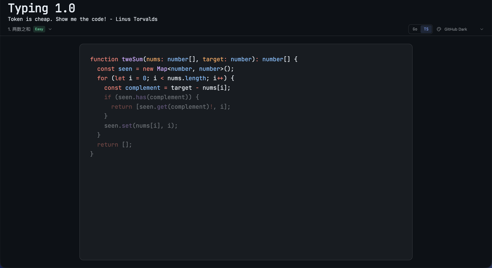

<div align="center">

```ascii
████████   ██   ██   ██████    ███████   ██   ██    ██████
   ██      ██   ██   ██   ██      █      ████ ██   ██     
   ██       ██ ██    ██████       █      ███████   ██ ████
   ██        ███     ██           █      ██ ████   ██   ██
   ██         █      ██        ███████   ██   ██    ██████
```

**把力扣 Hot 100 当打字练习来敲**

[](https://react.dev)
[](https://www.typescriptlang.org)
[](https://vitejs.dev)
[](https://tailwindcss.com)
[](https://github.com/pmndrs/zustand)
[](https://shiki.style)

<p align="center">
  
</p>

</div>

---

## 快速开始

```bash
git clone git@github.com:umikok7/typing.git
cd typing

make setup   # 自动检查 Node 24、启用 corepack/pnpm、安装依赖
make dev     # 启动开发服务器 → http://localhost:5173
```

> 要求 Node.js ≥ 24（推荐通过 nvm 安装：`nvm install 24 && nvm use 24`）。

## 常用命令

| 命令 | 说明 |
|---|---|
| `make setup` | 一键初始化环境 + 安装依赖 |
| `make dev` | 启动开发服务器 |
| `make build` | 生产构建 |
| `make preview` | 预览构建产物 |
| `make typecheck` | TypeScript 类型检查 |
| `make lint` | ESLint 代码规范 |
| `make lint-style` | Stylelint 样式规范 |
| `make test` | 单元测试 |
| `make format` | Prettier 格式化 |

## 技术栈

| 层 | 选型 |
|---|---|
| 框架 | React 19 + TypeScript 6 |
| 构建 | Vite 8 |
| 样式 | Tailwind CSS v4（设计 Token） |
| 状态 | Zustand |
| 高亮 | Shiki（TextMate 语法 / JS 正则引擎） |
| 字体 | JetBrains Mono |

## 新增一道题

在 `src/features/typing/data/` 下添加同名题解（`go/xxx.go` + `ts/xxx.ts`），再在 `data/problems.ts` 里登记一行即可，前端无需其它改动。


---

<div align="center">Made with ⌨️ & ☕ · TYPING▌</div>
